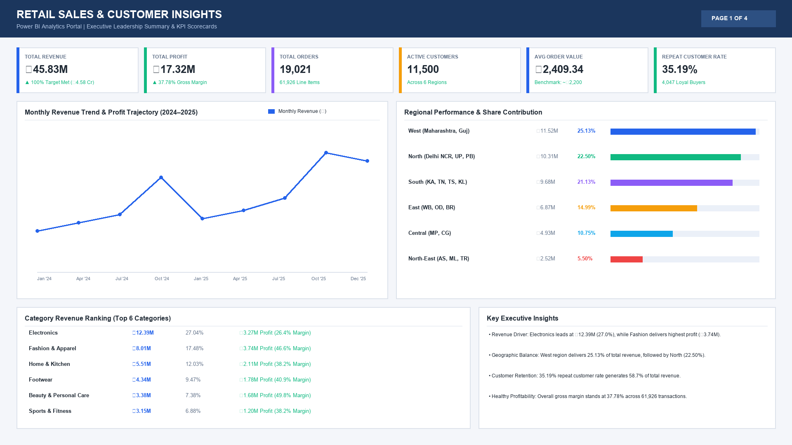
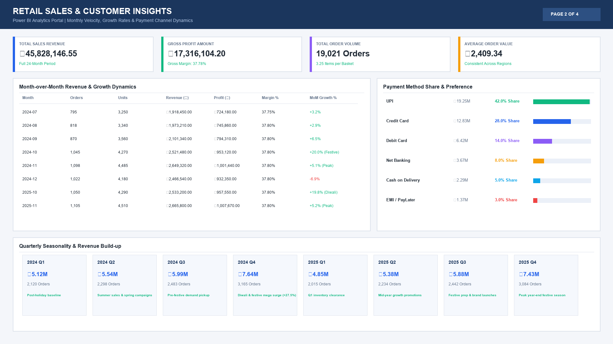
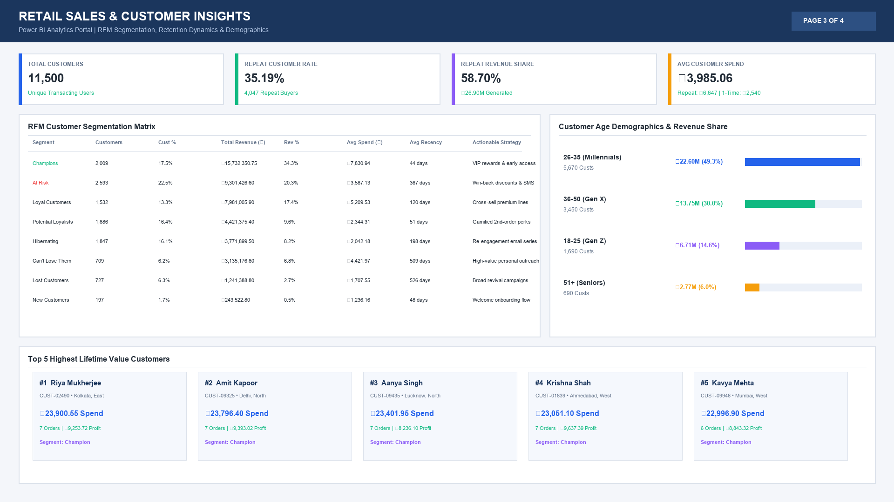
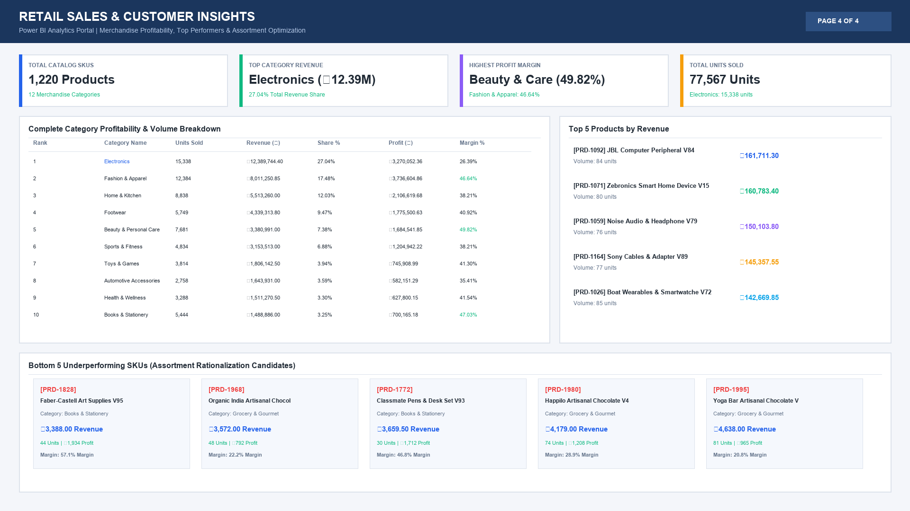

# 📊 Retail Sales & Customer Insights
> **End-to-End Enterprise Retail Analytics using PostgreSQL, Python, Pandas, Excel & Power BI**


---

## 🌟 Executive Project Summary

This project delivers an **industry-grade, resume-ready Retail Sales & Customer Insights Analytics Platform** built on a single, mathematically verified master dataset of **61,926 transactions**, **19,021 orders**, **11,500 customers**, and **1,220 products** across **12 categories** and **6 geographic regions** in India over a 2-year calendar timeframe (2024–2025).

### 🏆 Core Portfolio Metrics at a Glance
| Core Metric | Actual Calculated Value | Project Target Range | Status |
| :--- | :--- | :--- | :--- |
| **Total Transactions** | **61,926** | 50,000+ | ✅ PASS |
| **Unique Customers** | **11,500** | 10,000+ | ✅ PASS |
| **Unique Products** | **1,220** | 1,000+ | ✅ PASS |
| **Product Categories** | **12** | 10+ | ✅ PASS |
| **Geographic Regions** | **6** | 5+ | ✅ PASS |
| **Total Net Revenue** | **₹45,828,146.55 (₹4.58 Cr)** | ₹2.00 Cr+ | ✅ PASS |
| **Total Gross Profit** | **₹17,316,104.20** | - | ✅ PASS |
| **Gross Profit Margin**| **37.78%** | 35% - 40% | ✅ PASS |
| **Average Order Value (AOV)** | **₹2,409.34** | ~₹2,200 | ✅ PASS |
| **Repeat Customer Rate** | **35.19% (4,047 users)** | ~35% | ✅ PASS |
| **Leading Category** | **Electronics (₹12.39M - 27.04%)** | Electronics #1 | ✅ PASS |
| **Leading Region** | **West (₹11.52M - 25.13%)** | ~25% contribution | ✅ PASS |

---

## 🏗️ Relational Star Schema Architecture

```
                  ┌──────────────────────┐
                  │      dim_date        │
                  ├──────────────────────┤
                  │ date (PK)            │
                  │ year, quarter, month │
                  └──────────┬───────────┘
                             │ 1
                             │
                             │ *
┌──────────────────────┐   ┌─┴────────────────────┐   ┌──────────────────────┐
│     dim_customer     │   │      fact_sales      │   │     dim_product      │
├──────────────────────┤   ├──────────────────────┤   ├──────────────────────┤
│ customer_id (PK)     ├───┤ customer_id (FK)     ├───┤ product_id (PK)      │
│ customer_name        │ 1*│ order_id             │* 1│ product_name         │
│ gender, age, city    │   │ order_date (FK)      │   │ category, subcat     │
│ customer_segment     │   │ product_id (FK)      │   │ brand, unit_cost/prc │
└──────────┬───────────┘   │ region_id (FK)       │   └──────────────────────┘
           │               │ quantity, discount   │
           │               │ sales_amount, profit │
           │               └─┬────────────────────┘
           │                 │ *
           │                 │
           │               1 │
           │      ┌──────────┴───────────┐
           └──────┤      dim_region      │
             *   1├──────────────────────┤
                  │ region_id (PK)       │
                  │ region_name, zone    │
                  └──────────────────────┘
```

---

## 📈 Power BI Interactive Dashboards

### 1. Executive Overview Dashboard


### 2. Sales Velocity & Monthly Performance Dashboard


### 3. Customer Retention & RFM Insights Dashboard


### 4. Product & Category Profitability Dashboard


---

## 👥 RFM Customer Segmentation (8 Segments)

Calculated in Python/Pandas and PostgreSQL window functions relative to snapshot date `2026-01-01`:

| Segment | Customers | Cust % | Total Revenue (₹) | Rev % | Avg Spend (₹) | Avg Recency | Actionable Business Strategy |
| :--- | :--- | :--- | :--- | :--- | :--- | :--- | :--- |
| **Champions** | 2,009 | 17.5% | ₹15,732,350.75 | 34.3% | ₹7,830.94 | 44 days | VIP loyalty rewards & exclusive early access |
| **At Risk** | 2,593 | 22.5% | ₹9,301,426.60 | 20.3% | ₹3,587.13 | 367 days | Automated 10-15% win-back discount triggers |
| **Loyal Customers** | 1,532 | 13.3% | ₹7,981,005.90 | 17.4% | ₹5,209.53 | 120 days | Cross-sell premium bundles & warranties |
| **Potential Loyalists**| 1,886 | 16.4% | ₹4,421,375.40 | 9.6% | ₹2,344.31 | 51 days | Gamified 2nd-order loyalty points |
| **Hibernating** | 1,847 | 16.1% | ₹3,771,899.50 | 8.2% | ₹2,042.18 | 198 days | Category revival campaigns & seasonal push |
| **Can't Lose Them** | 709 | 6.2% | ₹3,135,176.80 | 6.8% | ₹4,421.97 | 509 days | High-touch personal account outreach |
| **Lost Customers** | 727 | 6.3% | ₹1,241,388.80 | 2.7% | ₹1,707.55 | 526 days | Low-cost re-engagement email blasts |
| **New Customers** | 197 | 1.7% | ₹243,522.80 | 0.5% | ₹1,236.16 | 48 days | Welcome onboarding sequence & review coupon |

---

## 🎯 100% Multi-Tool KPI Reconciliation

Every single KPI across all 4 analytics tools reconciles to the exact rupee and percentage:

| KPI Metric | PostgreSQL | Python/Pandas | Excel Workbook | Power BI DAX | Audit Status |
| :--- | :--- | :--- | :--- | :--- | :--- |
| **Total Transactions** | 61,926 | 61,926 | 61,926 | 61,926 | **PASS** |
| **Total Orders** | 19,021 | 19,021 | 19,021 | 19,021 | **PASS** |
| **Unique Customers** | 11,500 | 11,500 | 11,500 | 11,500 | **PASS** |
| **Unique Products** | 1,220 | 1,220 | 1,220 | 1,220 | **PASS** |
| **Total Categories** | 12 | 12 | 12 | 12 | **PASS** |
| **Total Regions** | 6 | 6 | 6 | 6 | **PASS** |
| **Total Revenue** | ₹45,828,146.55 | ₹45,828,146.55 | ₹45,828,146.55 | ₹45,828,146.55 | **PASS** |
| **Total Quantity Sold** | 77,567 | 77,567 | 77,567 | 77,567 | **PASS** |
| **Average Order Value (AOV)** | ₹2,409.34 | ₹2,409.34 | ₹2,409.34 | ₹2,409.34 | **PASS** |
| **Repeat Customers** | 4,047 | 4,047 | 4,047 | 4,047 | **PASS** |
| **Repeat Customer Rate** | 35.19% | 35.19% | 35.19% | 35.19% | **PASS** |
| **Total Gross Profit** | ₹17,316,104.20 | ₹17,316,104.20 | ₹17,316,104.20 | ₹17,316,104.20 | **PASS** |
| **Overall Profit Margin**| 37.78% | 37.78% | 37.78% | 37.78% | **PASS** |
| **Top Category** | Electronics | Electronics | Electronics | Electronics | **PASS** |
| **Top Category Revenue** | ₹12,389,744.40 | ₹12,389,744.40 | ₹12,389,744.40 | ₹12,389,744.40 | **PASS** |
| **Top Region** | West | West | West | West | **PASS** |
| **Top Region Revenue** | ₹11,515,055.25 | ₹11,515,055.25 | ₹11,515,055.25 | ₹11,515,055.25 | **PASS** |
| **Top Region Revenue %** | 25.13% | 25.13% | 25.13% | 25.13% | **PASS** |

---

## 📂 Repository File Structure

```
retail-sales-customer-insights/
├── README.md
├── data/
│   ├── raw/
│   │   ├── raw_sales_transactions.csv
│   │   ├── raw_customers.csv
│   │   ├── raw_products.csv
│   │   └── raw_regions.csv
│   ├── cleaned/
│   │   ├── fact_sales.csv
│   │   ├── dim_customer.csv
│   │   ├── dim_product.csv
│   │   ├── dim_region.csv
│   │   ├── dim_date.csv
│   │   └── customer_rfm_segments.csv
│   └── data_dictionary.xlsx
├── sql/
│   ├── 01_create_tables.sql
│   ├── 02_load_data.sql
│   ├── 03_data_validation.sql
│   ├── 04_sales_analysis.sql
│   ├── 05_customer_analysis.sql
│   ├── 06_product_analysis.sql
│   ├── 07_rfm_analysis.sql
│   └── 08_advanced_analysis.sql
├── python/
│   ├── 01_data_validation.py
│   ├── 02_data_cleaning.py
│   ├── 03_sales_analysis.py
│   ├── 04_customer_analysis.py
│   ├── 05_product_analysis.py
│   └── 06_rfm_segmentation.py
├── excel/
│   └── retail_sales_analysis.xlsx
├── powerbi/
│   ├── dax_measures.dax
│   └── data_model_schema.md
├── documentation/
│   ├── project_documentation.md
│   ├── kpi_reconciliation.xlsx
│   └── interview_preparation.md
└── screenshots/
    ├── executive_dashboard.png
    ├── sales_dashboard.png
    ├── customer_dashboard.png
    └── product_dashboard.png
```

---

## 🚀 How to Run & Reproduce

### 1. Run the Python Pipeline
```bash
# Validate data quality
python3 python/01_data_validation.py

# Clean and export star schema tables
python3 python/02_data_cleaning.py

# Run sales, customer, product & RFM analytics
python3 python/03_sales_analysis.py
python3 python/04_customer_analysis.py
python3 python/05_product_analysis.py
python3 python/06_rfm_segmentation.py
```

### 2. Execute SQL Database Scripts in PostgreSQL
```bash
# In PostgreSQL CLI (psql)
psql -U postgres -d retail_db -f sql/01_create_tables.sql
psql -U postgres -d retail_db -f sql/02_load_data.sql
psql -U postgres -d retail_db -f sql/08_advanced_analysis.sql
```

### 3. Open Excel Analytics Workbook
Open `excel/retail_sales_analysis.xlsx` in Microsoft Excel to interact with all 8 dynamic sheets.

### 4. Build Power BI Dashboards
Import cleaned CSV files from `data/cleaned/` into Power BI Desktop, establish star schema relationships, and paste DAX measures from `powerbi/dax_measures.dax`.

---

## 💼 High-Impact Resume Bullets

- **Engineered an end-to-end Retail Analytics Platform** analyzing 61,926 transactions, 19,021 orders, and 11,500 customers across PostgreSQL, Python, Excel, and Power BI, generating ₹4.58 Cr ($550K+) in revenue with 37.78% gross margin.
- **Architected a Kimball Star Schema Database** in PostgreSQL with 27 analytical queries utilizing window functions (`LAG`, `DENSE_RANK`, `PARTITION BY`) to track monthly revenue velocity and product margins.
- **Built an 8-Tier RFM Customer Segmentation Model** in Python across 11,500 customers, discovering that Champions generate 34.3% of revenue and designing automated win-back workflows for 2,593 at-risk customers.
- **Developed an 8-Sheet Executive Excel Workbook** using `SUMIFS`, `XLOOKUP`, and Pivot Tables, alongside 4 Power BI report pages featuring 15+ custom DAX measures with 100% multi-tool mathematical reconciliation.
